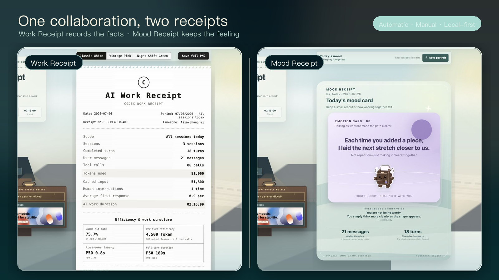

# Codex AI Receipts: Work Receipt + Mood Receipt

<p align="center">
  <a href="./README.md">中文</a> · <strong>English</strong>
</p>

<p align="center">
  <strong>Turn every Codex collaboration into a Work Receipt and a Mood Receipt.</strong><br>
  One command · Automatic or manual · Fully local · WeChat chat-file import
</p>

<p align="center">
  <a href="https://www.npmjs.com/package/codex-work-receipt"></a>
  
  
  
</p>

<p align="center">
  
</p>

<p align="center">
  <sub>The hero uses the current product UI to show the Work Receipt and Mood Receipt from the same collaboration.</sub>
</p>

## Two receipts

### Work Receipt

The Work Receipt is a measurable work record. It summarizes sessions, turns, tool calls, Tokens, duration, and models; reports cache hit rate, per-turn efficiency, P50 / P90 latency, a work-time heatmap, and model/tool structure; then adds playful AI work points, a job title, and a review.

### Mood Receipt

The Mood Receipt uses privacy-safe signals already present in the record—such as turns, messages, interruptions, response latency, and collaboration time—to express how the human–AI collaboration felt. It does not read prompts or responses, and it does not infer meaning from conversation content.

Generate either receipt on its own or include both. Neither receipt stores prompts, responses, source code, project paths, file names, tool arguments, or tool output.

The cwr2 protocol creates stable privacy-safe facts for each session and calendar day, allowing overlapping today, last-seven-days, and this-week receipts to be deduplicated. Every receipt also produces one `.cwr.json` WeChat import file. Scan import appears only when the complete payload fits in one data QR code.

## Sponsor

<table>
  <thead>
    <tr>
      <th width="180">Sponsor</th>
      <th>About</th>
    </tr>
  </thead>
  <tbody>
    <tr>
      <td align="center">
        <a href="https://modelflare.dev/sign-up?partner=OB9YXNSEEGOL&amp;utm_source=codex_work_receipt&amp;utm_content=banner_en_v2"></a>
      </td>
      <td>
        <a href="https://modelflare.dev/sign-up?partner=OB9YXNSEEGOL&amp;utm_source=codex_work_receipt&amp;utm_content=banner_en_v2"><strong>ModelFlare | AI Model API Gateway</strong></a><br>
        Thank you to ModelFlare for sponsoring this project. ModelFlare is a stable, lower-cost AI model API gateway that provides one place to access GPT, Claude, Grok, and other leading models, while tracking requests, token usage, and cost.
      </td>
    </tr>
  </tbody>
</table>

## Quickstart

Requires Node.js 20+ and local Codex session records. No clone is required.

### Choose the saving mode and receipt content

The first run asks two independent questions:

1. Saving mode: automatic saving or manual only.
2. Receipt content: Work Receipt, Mood Receipt, or both.

```bash
npx codex-work-receipt@latest --lang en
```

Run setup again whenever you want to change those choices:

```bash
npx codex-work-receipt@latest --setup --lang en
```

Saving mode and receipt content can be combined freely:

| Dimension | Option | What it does |
| --- | --- | --- |
| Saving mode | Automatic | Quietly refresh today's receipt after each Codex turn through the `Stop` hook |
| Saving mode | Manual only | Do not install the automatic hook; generate through a command or skill when needed |
| Receipt content | `work` | Work Receipt only |
| Receipt content | `emotion` | Mood Receipt only |
| Receipt content | `both` | Include both receipts (default) |

You can also choose the combination directly:

```bash
# Automatic saving + both receipts
npx codex-work-receipt@latest --enable-auto --receipt-type both --lang en

# Manual only + Mood Receipt
npx codex-work-receipt@latest --disable-auto --receipt-type emotion --lang en
```

`--disable-auto` only changes the saving mode. To generate a receipt immediately, follow it with a range command such as `--today` or `--hours`.

### Generate a receipt directly

For example, manually generate both receipts for today:

```bash
npx codex-work-receipt@latest --today --receipt-type both --lang en
```

Generate only one type:

```bash
npx codex-work-receipt@latest --today --receipt-type work --lang en
npx codex-work-receipt@latest --today --receipt-type emotion --lang en
```

Range and receipt type can be combined freely. For example, summarize the last 3 hours:

```bash
npx codex-work-receipt@latest --hours 3 --lang en
```

“Last N hours” is a rolling summary for private history only. It does not participate in AI Work Cooperative deduplicated accounting. Use today, this week, the last seven days, a specific session, or custom whole calendar dates when you want accountable canonical facts.

Interactively choose a session, project, or custom range:

```bash
npx codex-work-receipt@latest --select-session --lang en
npx codex-work-receipt@latest --select-project --lang en
npx codex-work-receipt@latest --custom-range --lang en
```

Advanced use can pass `--project <directory>`, `--from <start>`, and `--to <end>` directly. Whole calendar-date ranges produce cwr2 canonical facts; exact date-time ranges are private cwr1 summaries.

HTML, structured data, and the WeChat import file are written to `./codex-work-receipt-output/` by default. The page can download its `.cwr.json` file and export either receipt as a shareable image. A missing receipt type keeps its top tab and shows copyable regeneration commands instead of a blank panel. “More CLI features” provides 22 commands grouped by receipt type, range, selection, automation, Ticket Buddy, and help. See the [CLI guide](docs/cli.en.md).

## Automatic saving or manual only

Automatic saving uses the Codex `Stop` hook. Whenever a Codex turn stops, it quietly refreshes the same daily HTML, full JSON, and `.cwr.json` WeChat import file on this computer. It does not open a browser, upload files, or run a persistent watcher. The automatic path is file-first and does not generate a data QR.

Choose the mode again:

```bash
npx codex-work-receipt@latest --setup --lang en
```

Or enable, disable, and inspect automatic saving directly:

```bash
npx codex-work-receipt@latest --enable-auto --receipt-type both --lang en
npx codex-work-receipt@latest --disable-auto --lang en
npx codex-work-receipt@latest --auto-status --lang en
```

Use categorized help when you do not remember a command:

```bash
npx codex-work-receipt@latest --help --lang en
npx codex-work-receipt@latest --help receipt --lang en
npx codex-work-receipt@latest --help auto --lang en
npx codex-work-receipt@latest --help all --lang en
```

Automatic receipts live under `~/.codex-work-receipt/auto/YYYY-MM-DD/`. Switching to manual-only mode removes only the AI Work Receipt hook; it keeps existing receipts and unrelated Codex hooks. Restart Codex after installing the hook. If Codex asks you to review it, use `/hooks` to inspect and trust it. See the official [Codex hooks documentation](https://learn.chatgpt.com/docs/hooks).

## Desktop to mobile

The desktop page generates one privacy-safe `.cwr.json` file. Send it to WeChat File Transfer, then choose “Import from chat file” in the companion mini program. A single data QR remains available only for receipts that fit completely in one code. See [mobile import](docs/mobile-import.en.md).

## Ask Codex to create receipts

Install the AI Work Receipt skill to let Codex choose the range, run the command, and open the receipt from a natural-language request:

```bash
npx codex-work-receipt@latest --install-skill --lang en
```

For example:

> Create today's AI receipt.

> Create an AI receipt for my latest session.

See the [Codex Skill guide](docs/codex-skill.en.md).

## Optional extension: Ticket Buddy

Ticket Buddy is an optional companion for Codex's native Pets feature. It presents task state and provides companionship; it does not collect extra data, run the CLI, or alter the current task. You do not need Ticket Buddy to use either receipt.

<p align="center">
  <a href="docs/codex-pet.en.md"></a>
</p>

Install the skill and Ticket Buddy together:

```bash
npx codex-work-receipt@latest --install-companion --lang en
```

If the skill is already installed, install only the pet:

```bash
npx codex-work-receipt@latest --install-pet --lang en
```

Restart Codex, open `Settings > Pets`, select Refresh, choose “票仔 · AI 小票工” (Ticket Buddy), and use `/pet` to wake it. See the [Ticket Buddy setup and state guide](docs/codex-pet.en.md).

## Docs

- [CLI usage and options](docs/cli.en.md)
- [Codex Skill](docs/codex-skill.en.md)
- [Ticket Buddy Codex pet](docs/codex-pet.en.md)
- [Mobile file and single-QR import](docs/mobile-import.en.md)
- [Data schema, file, and QR protocol](docs/data-schema.en.md)
- [Local data and privacy](docs/privacy.en.md)
- [Contributing](CONTRIBUTING.md) · [Security](SECURITY.md) · [Changelog](CHANGELOG.md)

## License

The desktop source is licensed under [GNU GPL v3](LICENSE) (`GPL-3.0-only`). This is an unofficial community project and is not affiliated with OpenAI.

---

<p align="center">
  <strong>If the receipt made you smile, consider leaving a Star.</strong>
</p>
