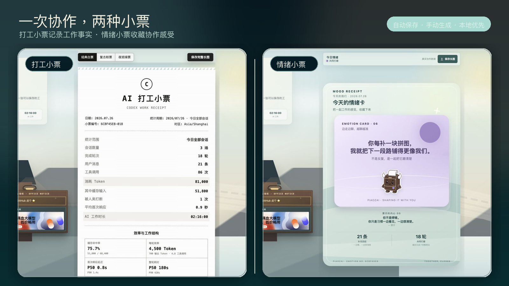

# Codex AI 小票：打工小票 + 情绪小票

<p align="center">
  <strong>中文</strong> · <a href="./README.en.md">English</a>
</p>

<p align="center">
  <strong>把每次 Codex 协作，整理成打工小票和情绪小票。</strong><br>
  一条命令 · 手动或自动 · 完全本地 · 微信聊天文件导入
</p>

<p align="center">
  <a href="https://www.npmjs.com/package/codex-work-receipt"></a>
  
  
  
</p>

<p align="center">
  
</p>

<p align="center">
  <sub>首图使用当前真实回执页面，展示同一次协作中的打工小票与情绪小票。</sub>
</p>

## 两种小票

### 打工小票

打工小票是可量化的工作记录：它统计会话、轮次、工具调用、Token、时长和模型，并提供缓存命中率、每轮效率、P50 / P90 延迟、工作时间热力图、模型与工具结构，生成带有 AI 工分、今日工种和点评的小票。

### 情绪小票

情绪小票用当前记录中的轮次、消息、打断、响应延迟和协作时长等隐私安全指标，表达这次人机协作的状态与感受。它不是读取 Prompt 或回复正文，也不是对对话内容做主观猜测。

两种小票可以只生成一种，也可以同时生成。无论生成哪一种，Prompt、回复正文、代码、项目路径、文件名、工具参数和工具输出都不会写入小票。

cwr2 协议按“会话 × 自然日”生成稳定的脱敏事实。今日、近 7 日和本周小票即使范围重叠，接收端也能识别相同工作。每张小票还会生成一个 `.cwr.json` 微信导入文件；只有完整数据能放进一个二维码时，网页才额外提供扫码导入。

## 赞助商

<table>
  <thead>
    <tr>
      <th width="180">赞助商</th>
      <th>介绍</th>
    </tr>
  </thead>
  <tbody>
    <tr>
      <td align="center">
        <a href="https://modelflare.dev/sign-up?partner=OB9YXNSEEGOL&amp;utm_source=codex_work_receipt&amp;utm_content=banner_cn_v2"></a>
      </td>
      <td>
        <a href="https://modelflare.dev/sign-up?partner=OB9YXNSEEGOL&amp;utm_source=codex_work_receipt&amp;utm_content=banner_cn_v2"><strong>ModelFlare｜AI 模型 API 网关</strong></a><br>
        感谢 Modelflare 赞助本项目。Modelflare 提供价格友好、稳定易接入的 AI 模型 API 网关，可通过统一入口使用 GPT、Claude、Grok 等主流模型，并集中查看请求、Token 用量与成本，适合个人开发者和团队。
      </td>
    </tr>
  </tbody>
</table>

## Quickstart

需要 Node.js 20 或更高版本，并且本机已经使用过 Codex。无需克隆仓库。

### 先设置保存方式和小票内容

第一次运行会依次选择两个维度：

1. 保存方式：自动保存或仅手动。
2. 小票内容：打工小票、情绪小票或两种都输出。

```bash
npx codex-work-receipt@latest
```

之后想重新选择，可以运行：

```bash
npx codex-work-receipt@latest --setup
```

保存方式和小票内容可以自由组合：

| 维度 | 选项 | 作用 |
| --- | --- | --- |
| 保存方式 | 自动保存 | 每轮 Codex 工作结束后，由 `Stop` Hook 静默刷新今天的小票 |
| 保存方式 | 仅手动 | 不安装自动保存 Hook，按命令或 Skill 需要时生成 |
| 小票内容 | `work` | 只输出打工小票 |
| 小票内容 | `emotion` | 只输出情绪小票 |
| 小票内容 | `both` | 同时输出两种小票（默认） |

也可以直接指定组合：

```bash
# 自动保存 + 两种小票
npx codex-work-receipt@latest --enable-auto --receipt-type both

# 仅手动 + 情绪小票
npx codex-work-receipt@latest --disable-auto --receipt-type emotion
```

`--disable-auto` 只负责切换为手动模式；如果要立即生成小票，再运行 `--today`、`--hours` 或其他范围命令。

### 直接生成小票

例如，手动生成今天的两种小票：

```bash
npx codex-work-receipt@latest --today --receipt-type both
```

只生成某一种：

```bash
npx codex-work-receipt@latest --today --receipt-type work
npx codex-work-receipt@latest --today --receipt-type emotion
```

时间范围和小票类型可以继续组合。例如，查看最近 3 小时的工作：

```bash
npx codex-work-receipt@latest --hours 3
```

“最近 N 小时”是滚动摘要，只用于查看和保存私人历史，不参与 AI 供销社的去重统计。需要进入供销社时，请生成“今日 / 本周 / 近 7 日 / 指定会话 / 自定义完整自然日”小票。

交互选择会话、项目或自定义区间：

```bash
npx codex-work-receipt@latest --select-session
npx codex-work-receipt@latest --select-project
npx codex-work-receipt@latest --custom-range
```

也可以使用 `--project <目录>`、`--from <开始>` 和 `--to <结束>` 直接指定。完整自然日区间生成 cwr2 规范事实；精确到时分的区间属于私人 cwr1 摘要。

网页、结构数据和微信导入文件默认保存在 `./codex-work-receipt-output/`。生成的网页支持一键下载 `.cwr.json`，也可以分别保存打工小票或情绪小票长图。未生成的类型仍保留顶部 Tab，并展示可复制的补齐命令。“更多命令行功能”提供 22 条可复制命令，按小票类型、时间范围、会话与项目、自动模式、票仔扩展和帮助分类展示。详见 [CLI 使用文档](docs/cli.md)。

## 自动保存或仅手动

自动保存使用 Codex 的 `Stop` Hook：每当 Codex 完成一轮工作，就在本机静默刷新当天同一张 HTML、完整 JSON 和 `.cwr.json` 微信导入文件。它不会打开浏览器、不会上传文件，也不会常驻监听进程。自动路径以微信文件导入为主，不生成数据二维码。

重新选择模式：

```bash
npx codex-work-receipt@latest --setup
```

也可以直接启用、关闭或检查自动保存：

```bash
npx codex-work-receipt@latest --enable-auto --receipt-type both
npx codex-work-receipt@latest --disable-auto
npx codex-work-receipt@latest --auto-status
```

命令较多时，可以使用分组帮助：

```bash
npx codex-work-receipt@latest --help
npx codex-work-receipt@latest --help receipt
npx codex-work-receipt@latest --help auto
npx codex-work-receipt@latest --help all
```

自动小票统一保存在 `~/.codex-work-receipt/auto/YYYY-MM-DD/`。切换为仅手动只会移除 AI 打工小票自己的 Hook，不会删除历史小票或其他 Codex Hook。安装 Hook 后请重启 Codex；如果 Codex 提示审查新 Hook，请使用 `/hooks` 确认并信任。Codex Hook 机制见 [官方文档](https://learn.chatgpt.com/docs/hooks)。

## 从电脑到手机

桌面网页会生成一个脱敏 `.cwr.json` 文件。把它发送到微信文件传输助手后，可在配套小程序中通过“从聊天文件导入”选择；数据足够小时也可以使用唯一的数据二维码快速导入。详见 [手机导入](docs/mobile-import.md)。

## 直接让 Codex 开票

安装 AI 打工小票 Skill 后，可以直接用自然语言让 Codex 选择范围、执行命令并打开小票：

```bash
npx codex-work-receipt@latest --install-skill
```

例如：

> 给今天的工作开一张 AI 小票。

> 给刚刚这次工作开一张 AI 小票。

详见 [Codex Skill 使用文档](docs/codex-skill.md)。

## 可选扩展：票仔桌宠

票仔是为 Codex 原生 Pets 制作的可选桌宠，负责状态展示和陪伴；它不会读取额外数据、运行 CLI 或改变 Codex 的任务。使用小票不需要先安装票仔。

<p align="center">
  <a href="docs/codex-pet.md"></a>
</p>

同时安装 Skill 和票仔：

```bash
npx codex-work-receipt@latest --install-companion
```

如果已经安装 Skill，也可以只安装桌宠：

```bash
npx codex-work-receipt@latest --install-pet
```

重启 Codex 后，在 `Settings > Pets` 中点击 Refresh，选择“票仔 · AI 小票工”，再输入 `/pet` 唤醒。详见 [票仔安装与状态说明](docs/codex-pet.md)。

## 文档

- [CLI 使用与全部参数](docs/cli.md)
- [Codex Skill](docs/codex-skill.md)
- [Codex 桌宠“票仔”](docs/codex-pet.md)
- [手机文件与单码导入](docs/mobile-import.md)
- [数据结构、文件与二维码协议](docs/data-schema.md)
- [本地数据与隐私说明](docs/privacy.md)
- [参与贡献](CONTRIBUTING.md) · [安全说明](SECURITY.md) · [更新日志](CHANGELOG.md)

## License

电脑端源码采用 [GNU GPL v3](LICENSE)（`GPL-3.0-only`）。本项目是非 OpenAI 官方社区工具。

---

<p align="center">
  <strong>如果这张小票让你觉得有点意思，欢迎点一个 Star。</strong>
</p>
